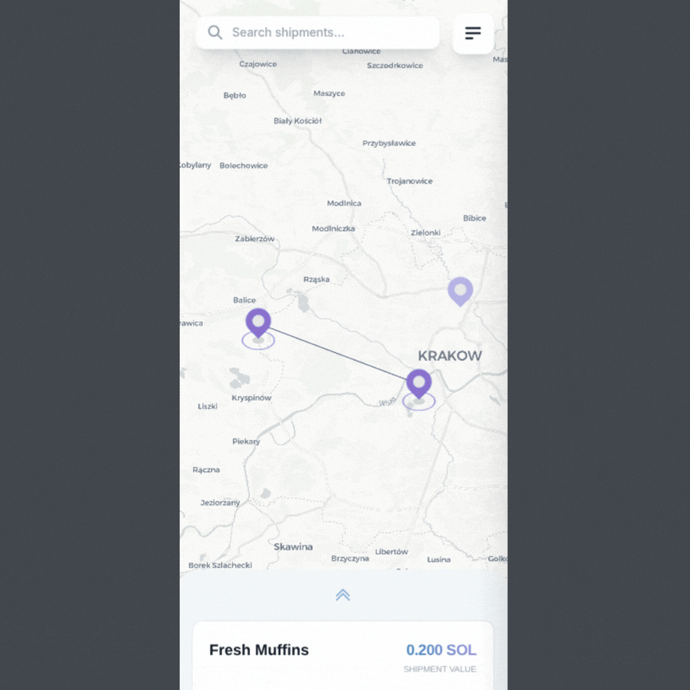

<div align="center"><h1>✈️ Sherpa - Decentralized Logistics Protocol</h1></div>

<br/>

Sherpa reimagines the logistics industry by creating a decentralized protocol where shipping transactions are executed through smart contracts on the Solana blockchain. The platform eliminates traditional intermediaries while maintaining the role-based structure that makes logistics efficient.

<br/>

<div align="center">
  
</div>

<br/>

### The Three Pillars

**🏭 Shippers**  
Create shipment requests with detailed specifications including dimensions, geography, collateral requirements, and deadlines. Each shipment is tokenized on-chain with transparent pricing and requirements.

**🔄 Forwarders**  
Act as market makers in the logistics ecosystem, purchasing shipments from shippers and reselling them to carriers. They manage risk, aggregate demand, and facilitate price discovery.

**🚚 Carriers**  
Compete for shipments through a bidding mechanism, offering competitive rates and delivery timelines. Once accepted, they execute the physical delivery and receive payment through smart contract escrow.

## Core Features

### 🔐 Trustless Escrow System

Smart contracts automatically handle payment flows, holding funds until delivery confirmation. Collateral and penalty mechanisms ensure accountability without requiring traditional legal frameworks.

### 💬 End-to-End Encrypted Messaging

Implements Diffie-Hellman key exchange for secure communication channels. While shipment data and transactions are publicly visible on-chain, private messages between parties are encrypted off-chain, ensuring sensitive delivery instructions and coordination remain confidential.

### 🎯 Competitive Bidding Mechanism

Carriers submit offers with custom payment amounts and timeout windows. The market-driven approach ensures competitive pricing while maintaining service quality through reputation systems.

### 🗺️ Geographic Intelligence

Full integration with MapLibre GL for real-time shipment visualization. Supports precise location data (latitude/longitude) with human-readable location names for both origin and destination.

### ⚡ High-Performance Blockchain

Built on Solana for sub-second transaction finality and minimal fees, making micro-transactions economically viable and enabling real-time logistics coordination.

## Protocol Architecture

### Smart Contract Layer (Anchor/Rust)

The on-chain program manages the entire logistics workflow through a series of instructions:

```rust
// User Registration & Identity
initialize_state()          // Bootstrap protocol
register_shipper(name)      // Onboard shipper
register_forwarder(name)    // Onboard forwarder
register_carrier(name, availability)  // Onboard carrier with availability

// Shipment Lifecycle
create_shipment(price, name, shipment_data)  // Shipper creates order
buy_shipment()              // Forwarder purchases
make_offer(payment, timeout)  // Carrier bids
accept_offer()              // Forwarder accepts bid

// Communication & Settlement
open_channel(public_key)    // Establish encrypted channel
send_message(key, message)  // Exchange encrypted messages
confirm_delivery()          // Release payment on completion
```

### On-Chain Data

Shipments store comprehensive details publicly on-chain including geographic coordinates, package dimensions (weight, width, height, depth), handling requirements (priority, fragility), financial terms (price, collateral, penalties), and scheduling information (pickup time, delivery deadline). This transparency enables market efficiency and trust.

### Frontend Application (SvelteKit)

A modern, responsive web interface built with SvelteKit, TypeScript, and Tailwind CSS. Features interactive mapping with MapLibre GL, Solana wallet integration, and the Anchor TypeScript SDK for seamless blockchain interaction.

## Workflow Example

### Complete Shipment Journey

1. **Shipper Creates Shipment**
   - Specifies origin (Tokyo) to destination (Los Angeles)
   - Sets weight: 5000g, dimensions: 300×200×150mm
   - Defines collateral: 2 SOL, penalty: 0.5 SOL
   - Lists price: 10 SOL, deadline: 7 days

2. **Forwarder Purchases**
   - Buys shipment from shipper (10 SOL transferred)
   - Sets resell price: 8 SOL (taking margin)
   - Shipment now available to carriers

3. **Carriers Compete**
   - Carrier A offers: 7 SOL, 48-hour timeout
   - Carrier B offers: 6.5 SOL, 24-hour timeout
   - Forwarder evaluates reputation + price

4. **Offer Acceptance**
   - Forwarder accepts Carrier B's offer
   - Smart contract locks 6.5 SOL in escrow
   - Encrypted communication channel opens

5. **Secure Communication**
   - Parties exchange DH public keys
   - Off-chain shared secret generation
   - Encrypted pickup/delivery instructions

6. **Delivery & Settlement**
   - Carrier completes delivery
   - Shipper confirms receipt on-chain
   - 6.5 SOL released to carrier
   - Collateral returned to shipper

## Encrypted Messaging System

### Diffie-Hellman Key Exchange

While shipment details, offers, and transactions are stored transparently on-chain for market efficiency, private communication between parties uses encrypted channels:

```
Carrier generates: (private_c, public_c)
Shipper generates: (private_s, public_s)

On-chain: Exchange public keys
Off-chain: Both compute shared_secret
         = public_c ^ private_s
         = public_s ^ private_c

AES encryption: encrypt(message, shared_secret)
Result: Only encrypted messages stored on-chain
```

This hybrid approach provides:

- Transparent marketplace for price discovery and trust
- Private messaging for sensitive delivery instructions
- End-to-end encryption without trusted intermediaries
- On-chain message history without revealing content

## Technology Stack

### Solana Blockchain

- **Speed**: ~400ms block time enables real-time logistics updates
- **Cost**: Minimal transaction fees make micropayments economically viable
- **Scalability**: High throughput supports global logistics volume
- **Anchor Framework**: Type-safe smart contract development with automatic TypeScript SDK generation

### SvelteKit Frontend

- **Performance**: Minimal runtime overhead with compile-time optimization
- **Developer Experience**: Reactive framework with less boilerplate
- **SSR**: Server-side rendering for improved SEO and initial load times
- **Web3 Integration**: Native Solana wallet adapter support

## Project Structure

```
sherpa/
├── programs/protocol/          # Solana smart contract
│   └── src/
│       ├── actions/            # Instruction handlers
│       │   ├── shipper/        # Shipper operations
│       │   ├── forwarder/      # Forwarder operations
│       │   ├── carrier/        # Carrier operations
│       │   └── channel/        # Messaging system
│       ├── data/               # Account structures
│       │   ├── shipment.rs     # Shipment models
│       │   ├── offer.rs        # Offer models
│       │   └── channel.rs      # Channel models
│       ├── events.rs           # Event emissions
│       └── errors.rs           # Custom error types
│
├── app/src/                    # Frontend application
│   ├── components/             # UI components
│   │   ├── ShipmentForm/       # Create shipments
│   │   ├── CarrierForm/        # Carrier registration
│   │   ├── Offer/              # Bidding interface
│   │   └── ShipmentMap/        # Geographic visualization
│   ├── routes/                 # SvelteKit pages
│   │   ├── carrier/            # Carrier dashboard
│   │   ├── forwarder/          # Forwarder dashboard
│   │   └── shipmentsMap/       # Map view
│   ├── stores/                 # State management
│   │   ├── anchor.ts           # Blockchain connection
│   │   ├── wallet.ts           # Wallet state
│   │   └── offers.ts           # Offer tracking
│   └── sdk/                    # Blockchain SDK wrapper
│
├── tests/                      # Integration tests
│   └── flow.spec.ts            # End-to-end workflow
│
└── migrations/                 # Deployment scripts
```

## Use Cases

### 🛒 E-commerce Integration

Online marketplaces can integrate Sherpa to offer decentralized shipping, reducing costs and increasing transparency for customers.

### 🌍 Cross-Border Trade

International shipments benefit from cryptocurrency payments, eliminating currency conversion fees and banking delays.

### 📦 Supply Chain Transparency

Complete on-chain record of shipment lifecycle provides immutable audit trail for compliance and quality assurance.

### 🏘️ Last-Mile Networks

Local carriers can participate in a global marketplace, creating peer-to-peer delivery networks for final-leg distribution.

### 🚢 Freight Forwarding

Automates traditional freight forwarding with smart contracts, reducing administrative overhead and settlement delays.

## Screenshots

<!-- Add screenshots here -->

---

**Built by** [FlashBois](https://github.com/FlashBois)  
**Powered by** Solana · Anchor · SvelteKit
